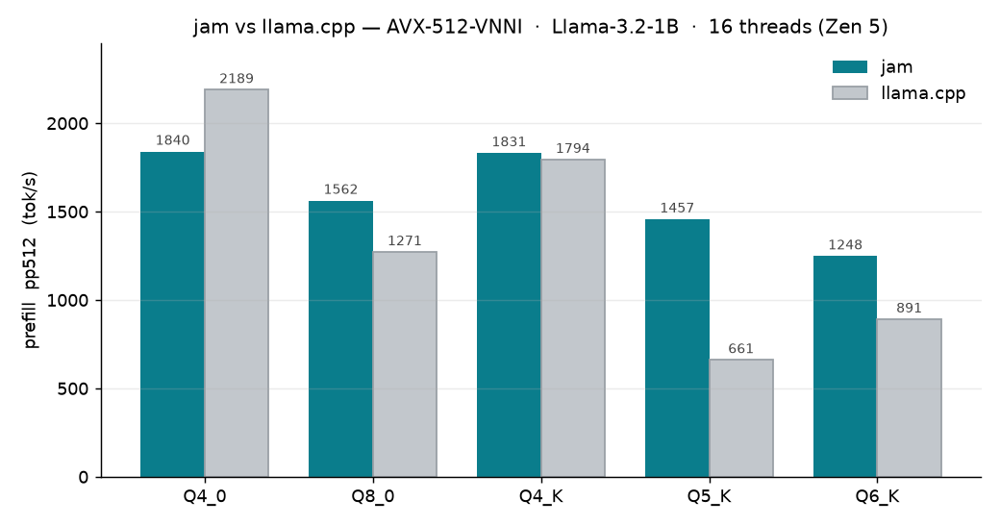
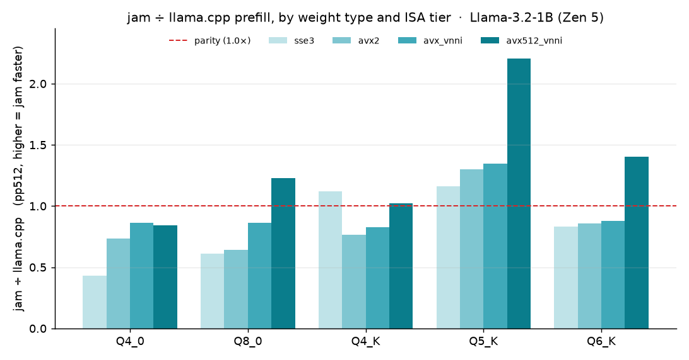

# jam

[](https://openjdk.org/projects/jdk/25/)
[](../LICENSE)
[](https://www.graalvm.org/latest/reference-manual/native-image/)


**JVM Accelerated Math** (or, jokingly, *just a matmul*). Fast quantized matrix multiplication for CPUs,
from Java or C.

jam supports Linux, Windows, and macOS, across many instruction sets — SSE3 through AVX-512-VNNI on x86,
NEON / DotProd / I8MM on ARM, and even Metal on Apple GPUs.

---

## Why jam?

- **A single op.** `jam_mm` computes `R = W @ Aᵀ`. Matrix-vector products (gemv) are supported implicitly
  at `n == 1`.
- **Picks the fastest kernel.** jam detects the supported CPU features/capabilities once and selects the
  best kernels, with no further per-call dispatch.
- **Parallel.** Every call runs across multiple threads.
- **No conversions.** Weights stay in their quantized format, byte-compatible with llama.cpp's `mul_mat`,
  so a `.gguf` tensor can be passed directly.
- **Single JAR, no Java dependencies.** It auto-extracts and loads the `jam` native library for the current
  OS/arch at runtime (override with `-Djam.native.library.path` / `JAM_NATIVE_LIBRARY_PATH`); which OS/arch
  builds ship depends on the available native toolchains.

---

## Quick start

### C

```c
#include <jam.h>

jam_status st = jam_mm(NULL,             // NULL = the global context
                       W, JAM_Q8_0, k,   // weights     [m x k]  (row stride k)
                       X, JAM_F32,  k,   // activations [n x k]
                       Y, JAM_F32,  m,   // result      [m x n]  (token-major, stride m)
                       m, n, k);         // R = W @ Aᵀ
```

### Java

`NativeJAM.global()` returns the native context (a `JAM`). Matmul is a bounds-checked call on native
`MemorySegment`s.

```java
JAM jam = NativeJAM.global();
int st = jam.mm(w, a, r, JAM.Q8_0, m, n, k);                 // contiguous: F32 activations + result

// strided, with byte offsets (zero allocation over one large mmap'd buffer):
int s2 = jam.mm(w, wOff, JAM.Q8_0, k,   // weight: segment, byte offset, dtype, row stride
                a, aOff, JAM.F32,  k,   // activations
                r, rOff, JAM.F32,  m,   // result   ->  R = W @ Aᵀ
                m, n, k);
```

`JAM` is a minimal interface with three implementations that ship in their own modules: **`NativeJAM`**
(`jam-native`, the libjam backend — the default), **`VectorJAM`** (`jam-vector`, a pure-Java SIMD backend
on the Java Vector API), and **`ScalarJAM`** (`jam-scalar`, a portable Java reference). Implement `JAM` to
add your own.

Supported quantizations include `Q4_0`, `Q8_0`, `Q4_K`, `Q5_K`, `Q6_K`, `MXFP4`, and `NVFP4`, plus dense
`F32`/`F16`/`BF16`. Activations and result are always `F32`. The operands must be **native** segments, not
heap arrays.

---

## Backends

jam detects the CPU and uses the best available kernel. Cap it with `JAM_ISA` or `cfg.max_isa`.

| arch | ISA ladder | Q8_0 dot |
|---|---|---|
| x86 | `sse3` → `ssse3` → `avx2` → `avx_vnni` → `avx512` → `avx512_vnni` | `vpdpbusd` (256/512-bit) |
| ARM | `neon` → `dotprod` → `i8mm` | `sdot` / `smmla` |
| GPU | `metal` (Apple, opt-in) | MSL compute |

`JAM_ISA=auto` (the default) picks the best; `JAM_ISA=metal` runs on the Apple GPU. SVE, AMX, and SME are
not yet implemented.

---

## Performance

jam holds its own against — and on its native AVX-512-VNNI path often **beats** — llama.cpp's hand-tuned CPU
kernels, at matched ISA. Prefill throughput (`pp512`, `R = W @ Aᵀ`), Llama-3.2-1B, 16 threads, Ryzen 9
9950X3D (Zen 5):



On its flagship VNNI tier jam wins four of five weight types — Q5_K by **2.2×**, Q6_K by **1.4×** — and the
*same* int8 kernels span the whole x86 ladder, from the pre-AVX2 floor up to AVX-512:



The sub-parity bars are the pre-VNNI Q4_0/Q8_0, where the int8 dot has no `vpdpbusd` to lean on; on the
k-quants jam is at or above parity at every tier. Numbers are one machine / one model — run `jam_bench` and
your own `pp512` to measure your hardware.

---

## Configuration

```sh
JAM_NUM_THREADS=16 JAM_ISA=avx2  ./app   # 16 threads, capped at AVX2
JAM_ISA=metal                    ./app   # Apple GPU
JAM_DEBUG=1                      ./app   # print detected features + bound kernels
```

For per-pool control, create a context explicitly:

```c
jam_config cfg = {.nthreads = 8, .max_isa = JAM_ISA_AVX2};
jam_ctx* ctx = jam_ctx_create(&cfg);
jam_mm(ctx, /* ... */);
jam_ctx_destroy(ctx);
```

A `jam_ctx` is a serial stream: one `mm` at a time. For concurrent matmuls, use one context per thread.

---

## Build

You need **CMake ≥ 3.16**, a **C11 compiler** (clang preferred), and a **JDK ≥ 25** (the current LTS).
On macOS, `xcode-select --install` covers clang, cmake, and the Metal frameworks. On Windows, clang is
required (MSVC can't build the SIMD kernels).

**Maven** runs cmake, javac, and the tests in one step:

```sh
mvn package      # -> dist/jam.jar  (native lib built for you)
mvn test         # configure + build + JUnit
```

**Or build just the native library with cmake** (no JVM — for the C API, or to pre-stage `dist/native/`
for a `-Djam.native.skip=true` jar build):

```sh
cmake -B build -DCMAKE_BUILD_TYPE=Release
cmake --build build           # -> build/libjam.so, staged into dist/native/
```

Flags: `-DJAM_METAL=OFF` (no Metal), `-DJAM_JNI=OFF` (C only), `-DJAM_TESTS=OFF`, `-DJAM_STRIP=ON`.
`mvn package -Djam.native.skip=true` reuses a pre-staged `dist/native/`.

Each host builds only the kernels it can run, and the library picks the best at runtime, so it works on
any CPU. CI builds each platform natively and merges them into one fat `jam.jar`.

---

## Tests

```sh
cd build && ctest --output-on-failure   # every kernel, 1 & 3 threads, vs a double-precision reference
./jam_bench [M N K] [iters]             # GMAC/s (compute) and GB/s (bandwidth)
```

---

## License

Apache 2.0
