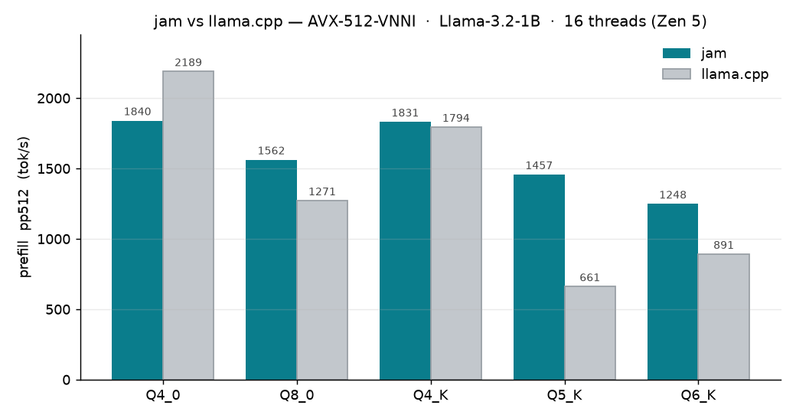
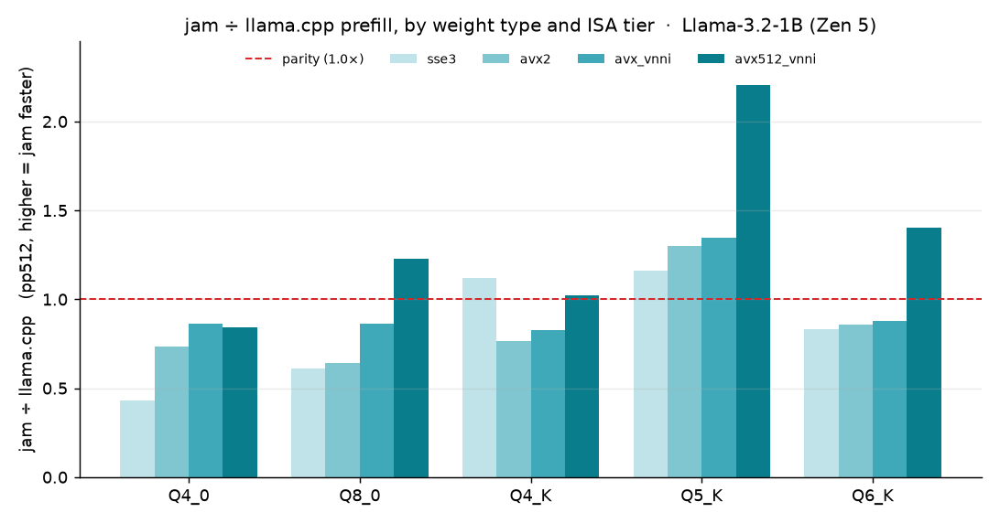

# jam

[](https://openjdk.org/projects/jdk/25/)
[](../LICENSE)
[](https://www.graalvm.org/latest/reference-manual/native-image/)


**Just a matmul.** The fastest quantized matrix multiplication on the JVM — one op, done
obsessively well, from Java or C.

jam computes `R = W @ Aᵀ` for LLM-scale workloads: SSE3 through AVX-512-VNNI on x86, NEON through
I8MM on ARM, and Metal on Apple GPUs. Weights stay quantized, byte-compatible with llama.cpp — a
`.gguf` tensor goes straight in, no conversions, no copies.

## Why jam

- **One op, no dispatch tax.** jam detects your CPU once, binds the best kernels, and never
  re-dispatches. Every call is multithreaded.
- **Beats llama.cpp at matched ISA.** Up to **2.2×** on the flagship AVX-512-VNNI tier —
  [see the numbers](#performance).
- **Zero ceremony.** `jam-native` bundles and loads the right native library for your OS/arch.
  No `-Djava.library.path`, no third-party runtime dependencies.
- **Speaks Java and C.** A minimal `JAM` interface with pluggable providers, and a small C API
  for everyone else.

## Quick start

### Java

```java
JAM jam = JAM.providers().getFirst().create();
int st = jam.mm(w, a, r, JAM.Q8_0, m, n, k);   // R = W @ Aᵀ, F32 activations and result
```

Strided, offset-based overloads operate zero-copy over one large mmap'd buffer. Providers ship
separately and self-register: `jam-native` (the default), `jam-vector` (Vector API, pure Java),
`jam-scalar` (the portable reference). Implement `JAM.Provider` to add your own.

### C

```c
#include <jam.h>

jam_status st = jam_mm(NULL,             // NULL = the global context
                       W, JAM_Q8_0, k,   // weights     [m x k]  (row stride k)
                       X, JAM_F32,  k,   // activations [n x k]
                       Y, JAM_F32,  m,   // result      [m x n]  (token-major, stride m)
                       m, n, k);         // R = W @ Aᵀ
```

Quantizations: `Q4_0`, `Q8_0`, `Q4_K`, `Q5_K`, `Q6_K`, `MXFP4`, `NVFP4`, plus dense
`F32`/`F16`/`BF16`. Operands are **native** `MemorySegment`s, not heap arrays. Launch flags,
module-path setup and provider selection: [docs](https://qxotic.ai/docs/jam).

## Performance

On its native AVX-512-VNNI path, jam often **beats** llama.cpp's hand-tuned CPU kernels at matched
ISA. Prefill throughput (`pp512`, `R = W @ Aᵀ`), Llama-3.2-1B, 16 threads, Ryzen 9 9950X3D (Zen 5):



jam wins four of five weight types on the flagship tier — Q5_K by **2.2×**, Q6_K by **1.4×** — and
the *same* int8 kernels span the whole x86 ladder, from the pre-AVX2 floor up to AVX-512:



One machine, one model. Run `jam_bench` against your own `pp512` to measure your hardware.

## Backends

jam detects the CPU and uses the best available kernel. Cap it with `JAM_ISA` or `cfg.max_isa`.

| arch | ISA ladder | Q8_0 dot |
|---|---|---|
| x86 | `sse3` → `ssse3` → `avx2` → `avx_vnni` → `avx512` → `avx512_vnni` | `vpdpbusd` (256/512-bit) |
| ARM | `neon` → `dotprod` → `i8mm` | `sdot` / `smmla` |
| GPU | `metal` (Apple, opt-in) | MSL compute |

`JAM_ISA=auto` (the default) picks the best. SVE, AMX, and SME are not yet implemented.

## Configuration

```sh
JAM_THREADS=16 JAM_ISA=avx2   ./app   # all providers: 16 threads, capped at AVX2
JAM_DEBUG=1                   ./app   # print detected features + bound kernels
```

Per-provider overrides (`-Djam.<provider>.threads=N`), explicit `jam_ctx` pools, and the override
knobs for the bundled native library: [docs](https://qxotic.ai/docs/jam).

## Build

CMake ≥ 3.16, a C11 compiler (clang; MSVC can't build the SIMD kernels), JDK ≥ 25. From the
repository root:

```sh
mvn -pl jam/jam-vector -am package -DskipTests   # jars under jam/*/target (native lib first)
mvn -pl jam/jam-vector -am verify                # ...including the backend parity suite
```

Or the native library alone (no JVM): `cmake -B build -DCMAKE_BUILD_TYPE=Release && cmake --build build`.
jam is not dependency-closed (`jam-core` builds on `jota-core`) — build from the root, or run
`mvn install` there once.

## Tests

```sh
cd build && ctest --output-on-failure   # every kernel, 1 & 3 threads, vs a double-precision reference
./jam_bench [M N K] [iters]             # GMAC/s (compute) and GB/s (bandwidth)
```

## License

Apache 2.0
